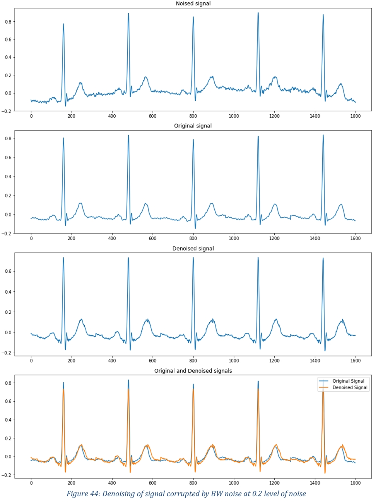

# ECG Denoising & Classification with GAN (TFM UAB)

**Trabajo Final de Máster en Ingeniería de Telecomunicación (UAB, 2022)**: Denoising de señales ECG usando GAN tipo Pix2Pix (Encoder-Decoder + PatchGAN) y clasificador CNN para arritmias. Usa datasets MIT-BIH de PhysioNet.

[](https://github.com/luistrima)
[](https://python.org)
[](https://tensorflow.org)
[](LICENSE)
[](LICENSE-THESIS)

## Descripción

Implementa:
- **GAN para denoising**: Elimina ruido (BW, MA, EM) de ECG.
- **CNN clasificador**: Detecta tipos de latidos (N, L, R, A, V, /).

Resultados: Mejora visual y métricas en denoised signals; accuracy >95% en clasificación.

**Tesis completa**: [PDF](./thesis/LuisTriviño_MasterTesis.pdf)

## Estructura

notebooks/ # Código principal
data/ # Datasets (enlaces)
results/figures/ # Outputs y plots
thesis/ # Documento académico


## Instalación rápida

1. Clona: `git clone https://github.com/luistrima/ecg-gan-thesis.git`
2. Entorno: `pip install -r requirements.txt`
3. Datasets: Sigue `data/README.md` (PhysioNet MIT-BIH).
4. GPU recomendada (TensorFlow).

## Uso

```bash
cd notebooks
jupyter notebook ecg_classificator_clean.ipynb
```

- Celdas secuenciales: carga datos → preprocess → entrena GAN → entrena CNN → evalúa.
- Outputs en `results/`.

## Resultados clave

### 1. Modelo de Eliminación de Ruido (GAN)
* **Eficacia con ruidos MA y BW:** La red GAN, implementada con una arquitectura tipo Pix2Pix, demostró un comportamiento muy correcto al eliminar artefactos musculares (MA), la desviación de la línea base (BW) y las combinaciones de ambos. Las ondas de las señales resultantes se asemejan mucho a la señal original limpia.
* **Viabilidad de las redes GAN para señales 1D:** El proyecto aporta valor al demostrar que este tipo de redes neuronales tienen un gran potencial en campos más allá del procesamiento de imágenes.
* **Limitación frente a magnitudes elevadas:** Se comprobó que a medida que aumenta el nivel del ruido añadido, la red neuronal pierde eficiencia a la hora de restaurar la señal correctamente.
* **Dificultad con el ruido EM:** El modelo tuvo problemas para tratar el ruido de artefactos de movimiento de electrodos (EM) y sus combinaciones. Este tipo de ruido enmascara demasiado la señal, lo que provoca que la red acabe inventando los picos representativos de las ondas del ECG.

### 2. Modelo de Clasificación de Latidos (CNN)
* **Precisión excepcional:** Se diseñó una Red Neuronal Convolucional capaz de clasificar exitosamente 6 tipos distintos de latidos cardíacos (N, L, R, A, V y /). Durante las pruebas, el modelo alcanzó una precisión (*accuracy*) del 99,83%.
* **Dataset balanceado:** El clasificador se entrenó y validó utilizando un conjunto de datos balanceado de 30.000 muestras en total (5.000 por cada tipo de latido).



## Citar
Luis G. Triviño Macías. "Electrocardiogram Denoising Using Generative Adversarial Network".
TFM, UAB, 2022.

## Licencia

MIT para código; CC BY-NC-SA 4.0 para tesis.

## Agradecimientos

Supervisor: José López Vicario. Datasets: PhysioNet.